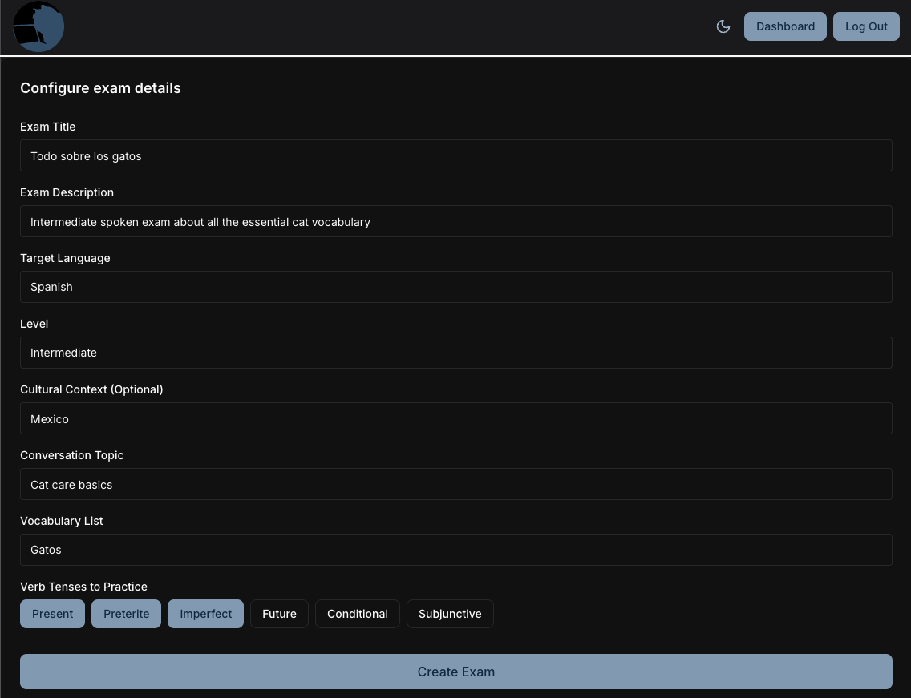
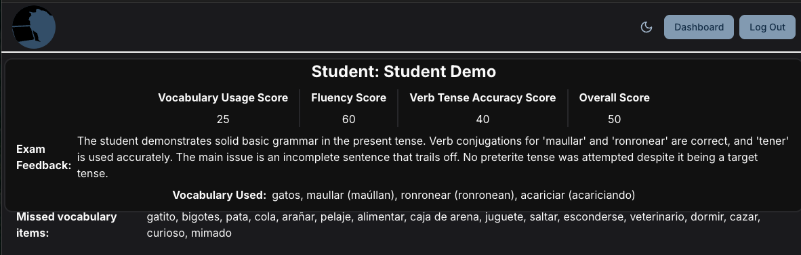
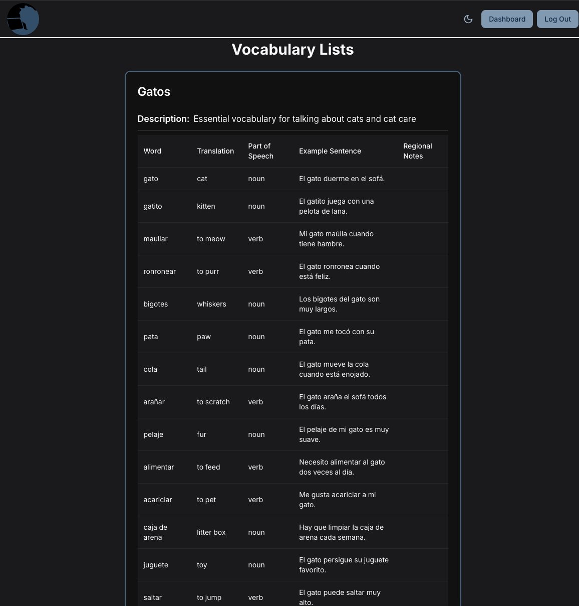
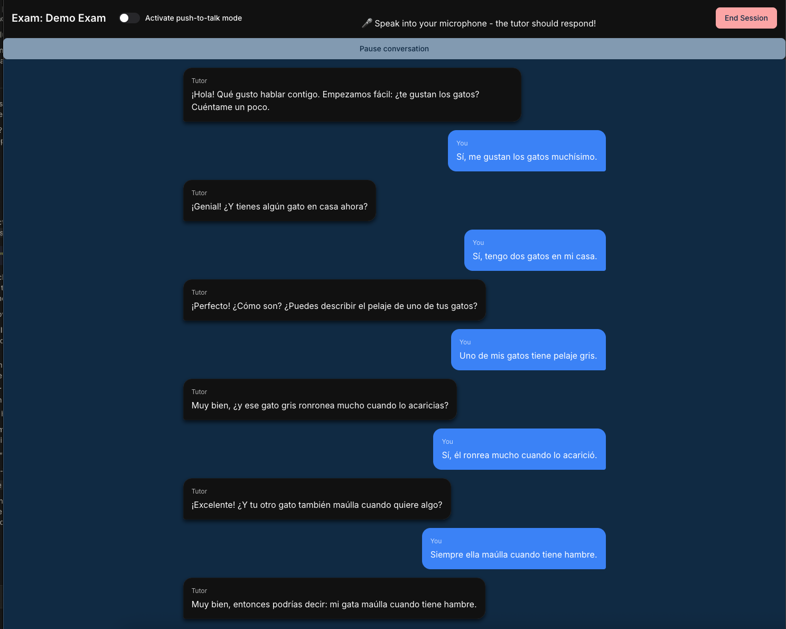

# Gato Lingo — AI-Powered Language Tutor & Assessment Platform

Gato Lingo is a full-stack web application that lets language teachers create **spoken, conversational exams** and have their students complete them by talking — in real time — with an AI tutor. Every conversation is automatically transcribed, persisted, and graded by an LLM against the teacher's rubric (vocabulary, grammar, verb tenses, and fluency).

> **Live demo:** [gato-lingo.netlify.app](https://gato-lingo.netlify.app)
> **Languages supported:** Spanish, French (the architecture is language-agnostic)

---

## What it does

Gato Lingo solves a real pain point in language education: speaking practice and oral assessment don't scale. A teacher can only sit through so many one-on-one conversations. This app automates that loop.

### For teachers

- **Author exams** by specifying a topic, target verb tenses, a vocabulary list, and cultural context. The app generates a tailored AI tutor "persona" prompt from those inputs.
- **Manage reusable vocabulary lists** that can be attached to any exam.
- **Assign exams** to individual students.
- **Review AI-generated scores** with per-category breakdowns and specific, actionable feedback (which target words were used vs. missed, grammar errors, tense accuracy, fluency notes).

### For students

- **Take exams by speaking** — a natural, real-time voice conversation with an AI tutor that stays in the target language and adapts to the student's level.
- Receive structured feedback after each session.

---

## Screenshots

### Teacher dashboard — exam creation



### Teacher dashboard — score review



### Vocabulary list management



### Student — live spoken exam



<!--
To add more, follow the same pattern:
### Caption

-->

---

## Technical stack

| Layer                  | Technology                                                                                                              |
| ---------------------- | ----------------------------------------------------------------------------------------------------------------------- |
| **Frontend**           | React 18, TypeScript, Vite, Chakra UI v3, React Router 7, Zod, Axios                                                    |
| **Backend**            | Python 3.11, FastAPI, SQLModel / SQLAlchemy 2, Pydantic v2                                                              |
| **Database**           | PostgreSQL 17 (local via Docker; Neon in production)                                                                    |
| **AI / ML**            | Anthropic Claude (Haiku for conversation, Sonnet for grading), OpenAI Realtime API (WebRTC), OpenAI Whisper (STT) & TTS |
| **Auth**               | JWT (HS256) in HTTP-only cookies, Argon2 password hashing (`pwdlib`)                                                    |
| **Realtime transport** | WebSockets + WebRTC (browser ↔ OpenAI)                                                                                  |
| **Infra / DevOps**     | Docker Compose (local Postgres + pgAdmin), Render (API), Netlify (SPA)                                                  |

---

## Architecture highlights

The most interesting engineering decision is that the app contains **two parallel voice pipelines** and the frontend routes between them depending on the use case.

### 1. Legacy WebSocket pipeline (server-orchestrated)

```
Browser ──audio──▶ FastAPI WebSocket
                      │
                      ├─▶ OpenAI Whisper        (speech → text)
                      ├─▶ Anthropic Claude Haiku (generate tutor reply)
                      └─▶ OpenAI TTS            (text → speech)
                      │
Browser ◀──audio──────┘   (each turn persisted to the DB)
```

The server fully orchestrates speech-to-text → LLM → text-to-speech, returning audio per turn. It is instrumented with high-resolution timing logs (`time.perf_counter()`) to profile the bottleneck — which turned out to be TTS.

### 2. OpenAI Realtime pipeline (WebRTC, low-latency)

```
Browser ◀───WebRTC peer connection───▶ OpenAI Realtime API
   │
   └─▶ FastAPI only mints an ephemeral token and grades the result
```

For live student exams, the browser opens a direct **WebRTC** connection to OpenAI's Realtime API for sub-second latency. The backend's role shrinks to two endpoints: minting a short-lived ephemeral client secret (seeded with the exam's tutor prompt) and grading the conversation history once the session ends.

### Shared scoring engine

Both pipelines converge on a single grading path powered by **Claude Sonnet**, which returns a structured JSON rubric:

- `vocabulary_usage_score` + which target words were used / missed
- `grammar_accuracy_score` + specific errors
- `verb_tense_accuracy_score`
- `fluency_score` + natural-flow feedback

JSON is parsed defensively with a markdown-fence fallback to handle model output variability.

### Data model

Built on SQLModel with non-trivial relationships: self-referential teacher↔student links, exams that own generated prompts and vocabulary lists, append-only conversation turns, and one-to-one session scores. `TYPE_CHECKING` imports are used to break the circular import graph between models.

### Security & auth

- JWTs are HS256-signed and delivered in **HTTP-only cookies** (with `Authorization: Bearer` fallback), with cross-site cookie policy that adapts to the deployment environment.
- Passwords are hashed with **Argon2**; unknown-email logins run a dummy hash compare to defeat timing oracles.
- Tokens issued before a password change are rejected, forcing re-login after a reset.
- Role-based access control gates teacher-only endpoints.
- A per-user **daily usage-token** system rate-limits expensive AI calls, refreshed by a production cron script.

---

## Repository layout

```
.
├── backend/            # FastAPI app
│   └── app/
│       ├── controllers/   # REST routers (auth, exams, vocabulary, realtime, …)
│       ├── models/        # SQLModel tables
│       ├── services/      # conversation_engine, scoring_engine, STT/TTS, mocks
│       ├── websockets/    # legacy conversation handler
│       ├── dependencies/  # auth guards
│       └── main.py        # app entry point + router registration
├── frontend/           # React + TypeScript + Vite SPA
│   └── src/
│       ├── pages/         # route-level screens
│       ├── components/    # teacher & student dashboards, shared UI
│       ├── hooks/         # useRealtimeAPI (WebRTC), …
│       └── contexts/      # UserContext (JWT hydration)
└── docker-compose.yml  # local Postgres 17 + pgAdmin
```

---

## Running it locally

### Prerequisites

- Python 3.11, Node 18+, Docker

### 1. Database

```bash
docker-compose up -d        # Postgres on :5432, pgAdmin on :5050
```

### 2. Backend

```bash
cd backend
pip install -r requirements.txt
make dev                    # uvicorn on :8000 (auto-creates & seeds tables)
```

> Set `use_mock_services=true` in `.env` to iterate on the conversation flow without spending AI API quota.

### 3. Frontend

```bash
cd frontend
npm install
npm run dev                 # Vite on :5173
```

---

## Engineering takeaways

- **Real-time AI over WebRTC** — integrating a browser-to-OpenAI WebRTC peer connection (data channel, mic capture, audio playback) for a responsive voice UX.
- **LLM orchestration & structured output** — chaining STT → LLM → TTS, and coercing LLMs into reliable, parseable JSON for automated grading.
- **Pragmatic trade-offs** — keeping a fully server-orchestrated pipeline alongside a low-latency client-driven one, each suited to a different job, with shared persistence and scoring.
- **Production-minded auth & cost control** — cookie-based JWT auth with Argon2, RBAC, timing-attack mitigation, and a usage-token rate limiter on costly model calls.
- **Full deployment story** — containerized local dev, deployed across Render (API) and Netlify (SPA) with environment-aware configuration.
